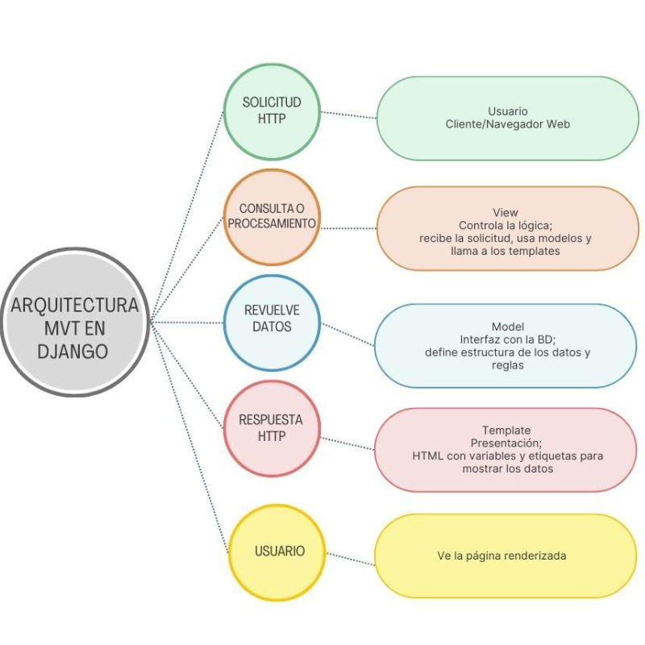

# 📘 Práctica Evaluatoria Parcial 3  

## **Construye aplicaciones web**

### Aparicio Hernandez Joselin  
### Huerta Cortes Melanie Johanna  
### Mejía Cruz Heidy Clarisa  
### Rodriguez Rodriguez Fatima  
### Salazar Acosta Layla Jayri  

**Grupo: 5 AMPG**

---

## 📑 ÍNDICE
<h2 align="center">Índice</h2>

<ul style="list-style-position: inside;">
  <li><a href="#introduccion">Introducción</a></li>
  <li><a href="#explicacion-de-los-comandos">Explicación de los comandos</a></li>
  <li><a href="#diagrama">Diagrama</a></li>
  <li><a href="#explicacion-de-los-archivos">Explicación de los archivos</a></li>
  <li><a href="#codigo-de-los-archivos">Código de los archivos</a></li>
  <li><a href="#ejecucion-final-de-lo-que-va-del-proyecto">Ejecución final de lo que va del proyecto</a></li>
  <li><a href="#conclusion">Conclusión</a></li>
</ul>

---

## ✨ Introducción
En esta práctica empezamos a utilizar la herramienta **Django**, que sirve para desarrollar aplicaciones porque ofrece rapidez, seguridad, escalabilidad y una gran comunidad de soporte.  
Es un framework de alto nivel que simplifica tareas comunes y permite construir proyectos muy grandes con menos esfuerzo. Utiliza la arquitectura **MVC (Modelo-Vista-Controlador)**, un patrón de diseño que separa una aplicación en tres componentes principales para mejorar la organización, mantenimiento y escalabilidad del código.  

---

## ⚙️ Explicación de Comandos
- **cd Documents** → Entra a la carpeta Documentos desde la terminal.  
- **md "tu nombre"** → Crea una nueva carpeta con el nombre indicado.  
- **cd "tu nombre"** → Entra a la carpeta creada.  
- **md Proyectos** → Crea una carpeta llamada *Proyectos*.  
- **cd Proyectos** → Entra a la carpeta *Proyectos*.  
- **md dj_marketplace** → Crea la carpeta del proyecto Django.  
- **cd dj_marketplace** → Entra a la carpeta del proyecto.  
- **python -m venv venv** → Crea un entorno virtual.  
- **venv\Scripts\activate** → Activa el entorno virtual.  
- **pip install django** → Instala Django.  
- **django-admin startproject marketplace_main** → Crea un nuevo proyecto.  
- **cd marketplace_main** → Entra al proyecto.  
- **python manage.py runserver** → Inicia el servidor local.  
- **ctrl + c + c** → Detiene el servidor.  
- **code .** → Abre el proyecto en VS Code.  
- **pip install Pillow** → Instala librería para imágenes.  
- **python manage.py migrate** → Aplica migraciones.  
- **python manage.py createsuperuser** → Crea usuario administrador.  
- **python manage.py makemigrations** → Genera archivos de migración.  
- **python manage.py startapp store** → Crea nueva aplicación.  
- **python manage.py changepassword** → Cambia contraseña de usuario.  

---

## 📊 Diagrama

Django usa la arquitectura **MVT**, similar a MVC:  
1. **Model** → Define cómo se estructuran y almacenan los datos.  
2. **View** → Contiene la lógica de negocio.  
3. **Template** → Se encarga de la presentación visual.  

---

## 📂 Explicación de Archivos
- **settings.py** → Configuración principal del proyecto.  
- **urls.py** → Conecta rutas con vistas.  
- **models.py** → Define las tablas de la base de datos.  
- **views.py** → Contiene la lógica de cada página.  
- **templates/store** → Carpeta para las plantillas HTML.  

---
